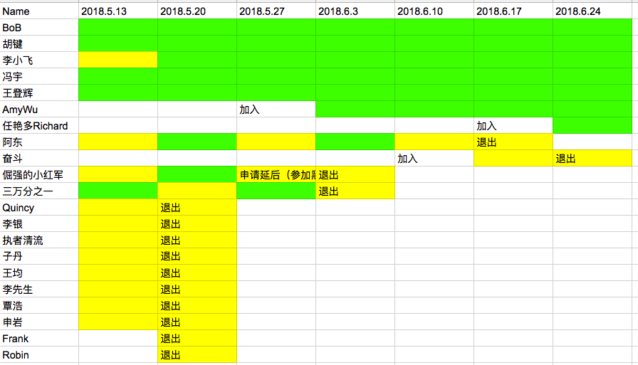

# Learning blockchain together

## What is the learning blockchain together

Learning Blockchain together ([HiBlock区块链技术布道](https://github.com/HiBlock/blockchain-learning))，成立于2018年5月13日，是一个以输出的方式来加速区块链技术学习的小组。

我们的宗旨是：抱团学习，一起学习共同输出，相互鼓励与扶持。

### 现状

持续7周时间，10位来自不同地区的小伙伴累计输出文章等素材44篇。给大家点个赞！

## What can I get

最好的学习就是教会别人，最好的学习是以目标为导向，不断思考不断输出的方式。

所以在这里，你不仅仅是写出自己的思想，还能结交一群同样喜欢思考的小伙伴。

## What can I do

非常简单，拿起你的键盘，写下你对于区块链的思考与认识。每周一篇文章，固定节奏与频率，和小伙伴们一起！

加入我们？ 参考下面的如何加入小结。

## How to join

- [github repo](https://github.com/HiBlock/blockchain-learning)
- 技术布道者：要求，1. 对区块链技术有热情； 2. 对技术布道有热情； 3. 请参考1和2
- 联系方式：bob@hiblock.net 、 微信：hiblocknet

## 关于 HiBlock 社区

HiBLock区块链社区秉承开放、协作、透明、链接、分享的价值观，致力打造一个专注于区块链的开发者社区，我们不仅在开发者中宣传推广区块链，还会帮助开发者真正掌握区块链技术和应用。

[HiBlock官网](https://hiblock.one/contact/)

## HiBlock community

Last, but not least, [hiblock community](https://hiblock.one) focuses on blockchain technology, could provide services like technology training, consulting, smart contract auditing, organizing hackthon etc.

If you have interest, please [Mail us](mailto:info@hiblock.one) . 
